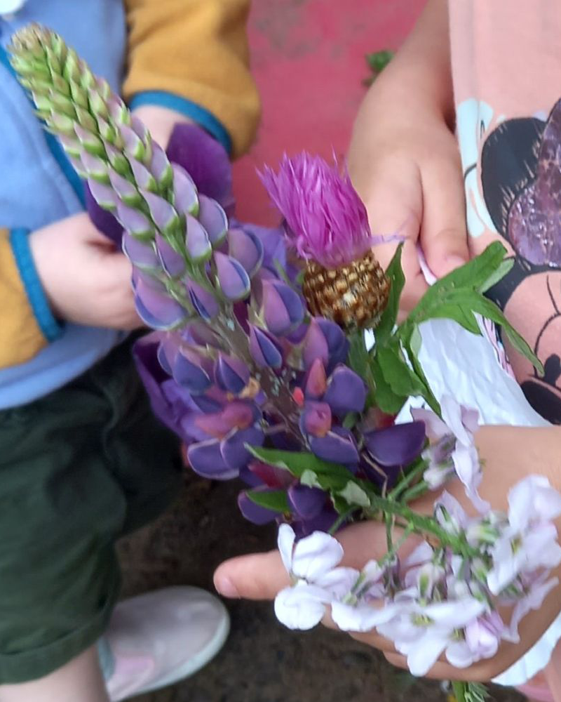
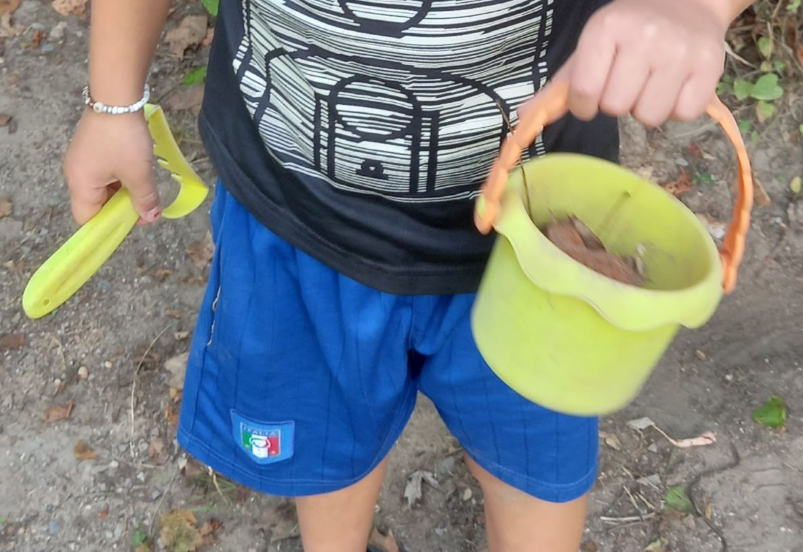
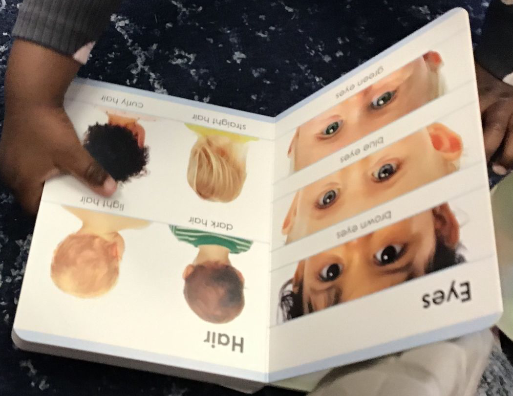
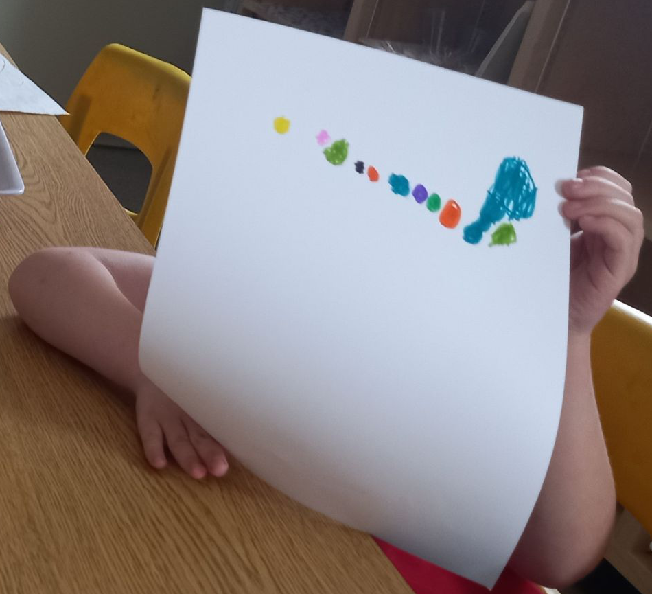
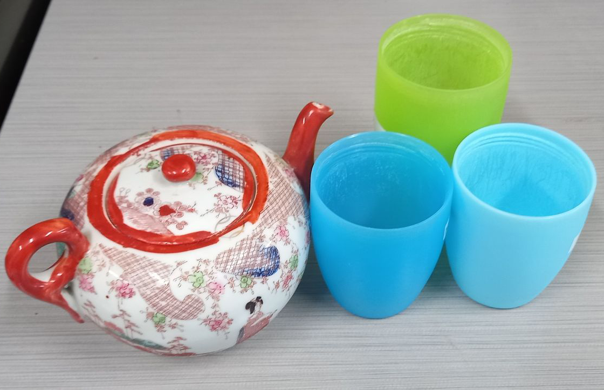

# Samples of Work

One of my first activities delivered in person: I provided a bucket of flowers, a container of water, and some small bins to do with as they liked. All kinds of learning happened, from sensory exploration with water, sand, and flower petals, "flower soup," and what should have been the obvious result for me: bouquets! One young lady spent the rest of the afternoon with her bouquet and declared it was for her wedding. She never did tell anyone who she planned to get married to!

An observation of natural learning in action. A young lad noticed bugs crawling out of the roots of some vines growing on the playground fence, so he collected some buckets and shovels and a friend to dig into the earth and see what they could find. They had quite the collection of rollie pollies by the day's end.

Introducing infants to new concepts is always such a fun experience. Here I was introducing a child to parts of the body. Since infants are still developing the concept of abstraction, I deliberately chose educational material that had pictures of real children to make it easier to connect the idea of the pictures to themselves.

In this art activity, I showed kindergarten children flashcards depicting various emotions, and then challenged them to draw something that made them think of that emotion. In this case, the colours themselves were the emotions, and the size of the colours were how much they were feeling that emotion at the time. Blue was happiness here!

A pretend-play tea party had spontaneously taken over the classroom one morning, and I sensed an opportunity. The next day, I hosted a "tea party" with "tea" served from a teapot I had brought from home and served into their milk cups - without the sippy tops attached. There were only two spills, and since the "tea" was just slightly sweetened tap water, these were cleaned without issue. I think the children were just as excited to drink "like grown-ups" as they were about getting to be part of a real tea party.

[back](./)
